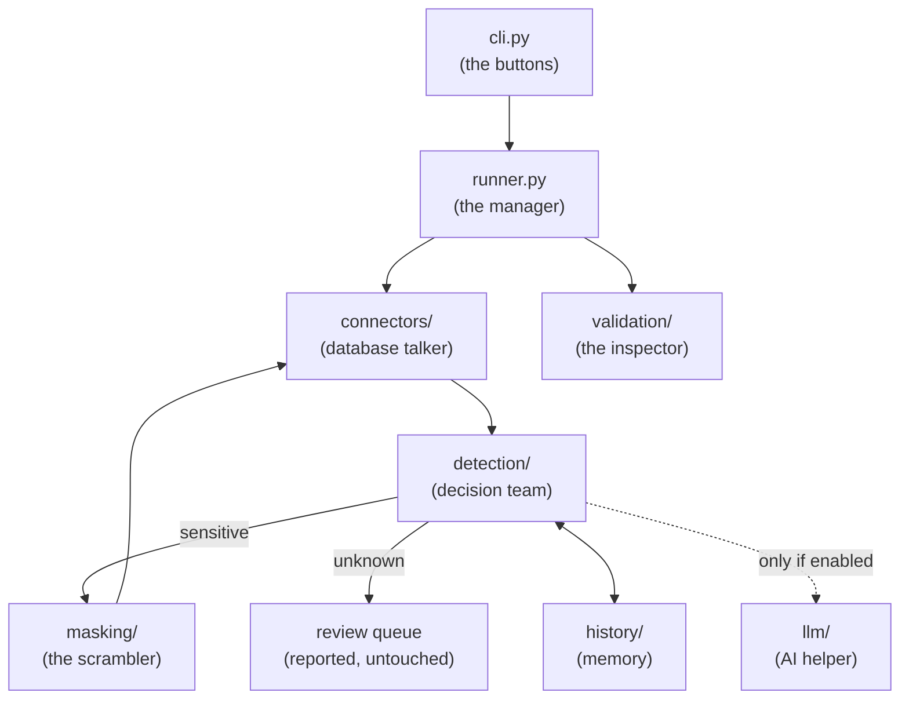

# Architecture

The project is a small assembly line where **each package has one job**.
Data flows left to right: connect → decide per column → transform → verify.

| Piece | Job |
|---|---|
| [`cli.py`](https://github.com/sealandseacat/dbmask/blob/main/src/dbmask/cli.py) | The `dbmask` commands (`scan`, `mask`, `validate`, `history`, `seeds`, `strategies`). Owns all *safety UX*: `--apply` gating, redacted previews, warnings. |
| [`config.py`](https://github.com/sealandseacat/dbmask/blob/main/src/dbmask/config.py) | Typed dataclasses for the YAML config, with `${ENV}` expansion. |
| [`runner.py`](https://github.com/sealandseacat/dbmask/blob/main/src/dbmask/runner.py) | Orchestration and the fail-closed rules (an incomplete scan refuses to mask). The library entry point. |
| [`connectors/`](https://github.com/sealandseacat/dbmask/tree/main/src/dbmask/connectors) | One SQLAlchemy code path for every dialect: introspection, sampling, keyset-paginated read→write (`iter_pages`), row updates. Subclass `Connector` for non-SQL sources. |
| [`detection/`](https://github.com/sealandseacat/dbmask/tree/main/src/dbmask/detection) | The layered pipeline: overrides → history → patterns → LLM → `UNKNOWN`. |
| [`history/`](https://github.com/sealandseacat/dbmask/tree/main/src/dbmask/history) | Decision store (any SQLAlchemy URL). Reproducibility and auditability. |
| [`llm/`](https://github.com/sealandseacat/dbmask/tree/main/src/dbmask/llm) | OpenAI-compatible + local providers behind one interface. |
| [`masking/`](https://github.com/sealandseacat/dbmask/tree/main/src/dbmask/masking) | Strategies, bundled dictionaries, the seed map, and the page-by-page ETL engine. |
| [`validation/`](https://github.com/sealandseacat/dbmask/tree/main/src/dbmask/validation) | Row counts, schema comparison, PK-aligned completeness. |

## Design choices worth knowing

**Keyset-paginated apply.** The engine reads one key-ordered page, writes it
back, then reads the next — reads and writes never overlap. (A streaming
read with interleaved writes deadlocks SQLite: the in-flight SELECT holds a
SHARED lock that blocks the writer's COMMIT.) Pages advance with an expanded
row-value comparison, so composite keys work on engines without native
row-value support.

**Decisions are data.** Every conclusive classification is a `Decision` row
in the history store — who decided (override/pattern/LLM/history), with what
confidence, when. `dbmask scan --json` and `dbmask history` expose the same
records for audit.

**Fail closed, everywhere.** Unanalyzed column → refuse to mask.
Unclassifiable column → `UNKNOWN`, reported, untouched, re-examined next
run. Unmaskable (key) column → excluded and announced. Unverifiable check →
warning that `--strict` turns into failure.

**The engine never invents data.** `NULL` in, `NULL` out, for every
strategy.

## Testing philosophy

Every bug fix lands with a regression test that fails on the old code, and
most tests drive the real CLI against real config files and throwaway SQLite
databases — the same code path a user hits. The suite (121 tests as of
0.1.1) doubles as documentation of every sharp edge found so far:
[`tests/`](https://github.com/sealandseacat/dbmask/tree/main/tests).
