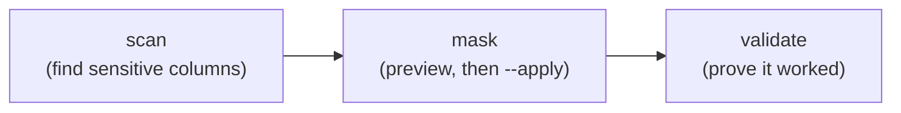

# dbmask

**Discover which columns hold sensitive data, mask them with realistic
deterministic fakes, then verify the masking actually happened** — one
auditable workflow for making safe copies of SQL databases.

```bash
pip install dbmask
```

Production data constantly leaks into places with weaker controls: dev and
test systems, demos, analytics warehouses, vendor handoffs, AI pipelines.
`dbmask` sits at the moment you copy that data:



- **Works over a connection string** — one SQLAlchemy code path for
  PostgreSQL, MySQL/MariaDB, SQL Server, Oracle, SQLite. No database
  extension to install, no dump files required.
- **Layered detection** — manual overrides → decision history → value
  patterns → optional LLM (including fully local models). Inconclusive
  columns are flagged `UNKNOWN` for review, never silently passed.
- **Deterministic, referentially consistent masking** — the same input masks
  to the same output everywhere; the [seed map](seed-map.md) makes that
  durable across runs, dictionary edits and seed changes.
- **Verification you can gate CI on** — row counts, schema comparison, and a
  [primary-key-aligned per-row check](validation.md) that no sensitive value
  survived. `--strict` fails on anything unverified.
- **Safe defaults** — dry-run unless `--apply`, fail-closed on incomplete
  scans, redacted previews, loud warnings for anything that could not be
  masked.

## Where to start

- New here? → [Getting started](getting-started.md)
- Setting it up for real? → [Configuration](configuration.md)
- "How does X mask?" → [Masking strategies](strategies.md)
- "Can I trust the output?" → [Validation](validation.md) and the
  [security model](security-model.md)
- "How does it stay consistent?" → [The seed map](seed-map.md)

## Project

`dbmask` is MIT-licensed and developed in the open at
[github.com/sealandseacat/dbmask](https://github.com/sealandseacat/dbmask).
Bug reports, feature requests, and [adopter feedback](https://github.com/sealandseacat/dbmask/issues/new?template=adopter_feedback.yml)
(including *"we chose something else because…"*) all shape the
[roadmap](roadmap.md).
