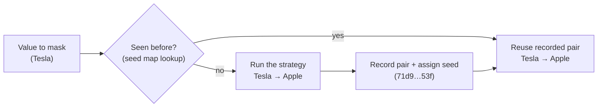

# The seed map — durable consistency

Masked data is only useful if it is **consistent**: if `Tesla` becomes
`Apple`, it must become `Apple` in every column, every table, and every
future run — otherwise joins break and last month's test database disagrees
with this month's.

## Why determinism alone is not enough

`masking.seed` makes masking *recomputable*: strategies derive their RNG from
`sha256(seed + value)`, so the same input recomputes to the same output. But
nothing is written down, so the mapping silently changes whenever its inputs
do:

| Change | Effect without the seed map |
|---|---|
| Someone sorts `us_cities.txt` | **every** dictionary mapping changes |
| Someone appends one new city | some mappings shift |
| `masking.seed` is edited | **every** mapping changes |

The **seed map** (on by default) fixes this by *persisting the decision
instead of recomputing it*: the first time a value is masked, the pair is
recorded and assigned a **seed token**; every later run looks it up and
reuses it.



```yaml
masking:
  seed_map:
    enabled: true            # ON by default
    url:                     # blank = sqlite:///dbmask_seedmap.db
    salt: ${DBMASK_SEED_SALT}
    untracked_strategies: ["null", "blank", "redact"]
```

Dry runs **read** the seed map (so previews match a later `--apply`) but
never write it — previews have no side effects.

## How the seed is calculated

The seed is derived from the value, not invented at random — that is the
trick that lets a future run find the pair without the original ever being
stored:

```text
fingerprint = sha256( salt | strategy | original_value )

  value_hash = fingerprint         (full 64 hex chars — the lookup key)
  seed       = fingerprint[:16]    (short token — how you refer to the pair)
```

Worked example, masking `Tesla` in a `fake_city` column:

| Step | What happens |
|---|---|
| 1 | Fingerprint `Tesla` → `71d94372…` |
| 2 | Look up the hash → **miss**, first time seen |
| 3 | Run the strategy → `Tucson` |
| 4 | Store `seed=71d943727714753f, scope=fake_city, masked=Tucson` |
| 5 | Next run, `Tesla` fingerprints identically → **hit** → `Tucson`, without running the strategy at all |

Step 5 is why the mapping is stable: the strategy — and therefore dictionary
contents, order, and `masking.seed` — is consulted **once per distinct value,
ever**.

Consequences worth knowing:

- **The seed token is an identifier, not a secret.** Safe to quote in a
  ticket to refer to a pair; it reveals nothing on its own.
- **Pairs are namespaced per strategy** (`scope`), so `Tesla`-as-city and
  `Tesla`-as-name cannot collide — and every column sharing a strategy masks
  the value identically, which is what keeps joins intact.
- **Typed values round-trip.** The store keeps text; on reuse the value is
  coerced back to the original's Python type (int, date, UUID, …) before
  being written to the column.

## Privacy

**Original values are never stored.** The lookup key is a salted SHA-256
hash: the store holds `hash(Tesla) → "Tucson"`, never `"Tesla" → "Tucson"`.
You cannot read it to learn what a value became — only look up a value you
already hold — so it is not a reversal table.

One honest limit: by default the salt is generated once and kept *inside*
the store. Anyone holding the store then also holds the salt, and masked
columns often draw on small, guessable value sets — such a holder could hash
candidate values to test membership. If that matters in your threat model:

```yaml
masking:
  seed_map:
    salt: ${DBMASK_SEED_SALT}   # never written to disk
```

!!! warning
    Changing the salt **orphans every existing pair** — they can no longer be
    found, and values start mapping afresh. Choose it once; keep it with your
    backups. The seed-map database itself is worth backing up too: lose it
    and future runs re-derive mappings that disagree with already-masked
    copies.

## Inspecting tracked pairs

```text
$ dbmask seeds --config dbmask.yaml
Tracked pairs: 5

SEED               SCOPE              MASKED VALUE
71d943727714753f   fake_city          Tucson
60e256a96b19d5d1   fake_city          Seattle
```

Originals are not shown because they are not stored. `--json` for machines,
`--limit` to page.

## Turning it off

`masking.seed_map.enabled: false` — masking stays deterministic *within* the
current inputs, but nothing persists and mappings drift again whenever a
dictionary or the seed changes.
