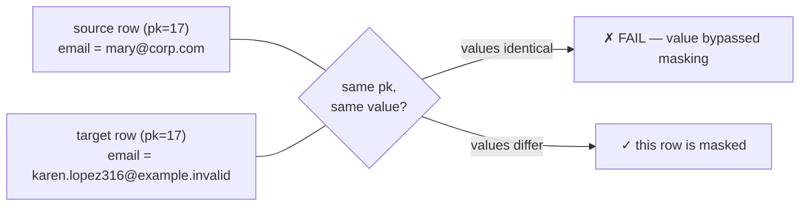

# Validation — check the work

Masking you cannot verify is hope, not a control. `dbmask validate` compares
the **masked** database (`database`) against the **untouched original**
(`source_database`) and exits non-zero on failure, so it slots directly into
a CI/CD gate:

```bash
dbmask validate --config dbmask.yaml --strict
```

## The three checks

| # | Check | What it proves |
|---|---|---|
| 1 | **Row counts** | masking changed values — it never added or dropped rows |
| 2 | **Schema elements** | columns/types, primary key, indexes, foreign keys, unique & check constraints all match |
| 3 | **Masking completeness** | per-row: no sensitive value survived unchanged |

Tables that exist on only one side are reported as warnings — nothing is
silently skipped.

## How completeness is checked

### Preferred: primary-key aligned

When source and target share a usable primary key, there is no guessing
about which row corresponds to which: rows are matched key-by-key and the
sensitive column is compared **value-by-value**.



This catches the failure the older heuristic could not: a row where the
email survived unmasked *while the name changed* — the row as a whole
differs, but the sensitive value is right there.

Coverage is bounded by `validation.pk_row_limit` (default 5 000 rows per
column, in key order). When a table is larger, the report **says so**:

```text
[✓] masking_completeness  main.people.email: PK-aligned comparison of 5000 row(s):
    every sensitive value differs from its source. [partial — first 5,000 row(s) in key order]
```

### Fallback: the overlap heuristic (keyless tables)

Without a key, rows cannot be aligned, so the check falls back to: find
values common to both sides (minus obvious test noise), then look for
**entire rows** identical across databases.

Why not just "are there common values?" — because dictionary masking swaps
real values for other real values. If the dictionary contains both `Tesla`
and `Apple` and so does your data, after masking `Tesla → Apple` and
`Apple → Tesla` the *column* still contains both strings while every *row*
changed. A column-level check would cry wolf; the row-level comparison does
not.

Two honesty rules apply to the heuristic:

- an identical whole row is still a hard **FAIL** (it plainly bypassed
  masking);
- a *clean* result is a **WARNING**, not a PASS — "no identical whole rows"
  is consistent with correct masking but cannot prove it. The message says
  exactly that.

## `--strict` and report semantics

| | `passed` (default) | `passed_strict` (`--strict`) |
|---|---|---|
| FAIL / ERROR | ✗ | ✗ |
| WARNING (e.g. keyless heuristic, missing table) | ✓ | ✗ |
| SKIPPED (e.g. no sensitive columns supplied) | ✓ | ✗ |

The non-strict summary line names its caveats rather than printing a bare
"PASSED":

```text
RESULT: PASSED ✓ — with 2 warning(s): not everything could be verified (use --strict to fail on this)
```

Use `--strict` in CI. Use the default interactively while iterating.

## Which columns get checked?

Priority order:

1. `validation.columns` — explicit `schema.table.column` list;
2. the **history store** — everything recorded as sensitive;
3. a fresh scan of the target.

Explicit is best for CI: the gate then can't quietly narrow because history
changed.

## Privacy of the reports themselves

FAIL details include the row keys plus **shape-redacted** samples
(`ma**@co**.***` style), never original values — validation output is safe
to keep in CI logs.

## Limits to keep in mind

- The PK-aligned check compares the first `pk_row_limit` rows per column in
  key order — raise it (or run per-table configs) for full sweeps of very
  large tables.
- Schema comparison covers what SQLAlchemy exposes portably; triggers and
  grants are not compared (extension point: override
  `Connector.schema_elements`).
- Validation tells you masking *happened*; whether the chosen strategy is
  *strong enough* is a design question — see the
  [security model](security-model.md).
